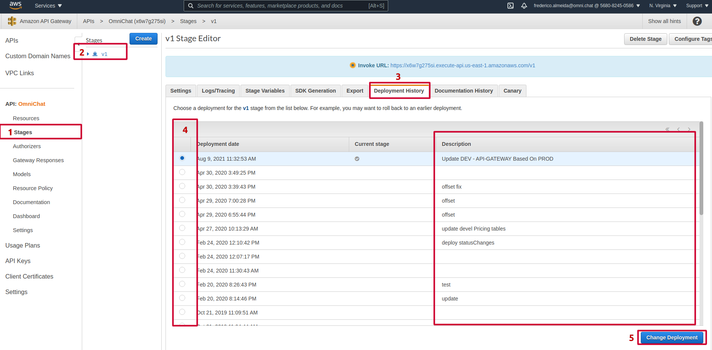

# Processo de atualização de documentação e serviço.

Dentro do repo [API-Adapter](https://github.com/OmniChat/API-Adapter) existe o yaml que deve ser atualizado aqui.
O fluxo é:

### 1. Atualizar o `swagger-omnichat-api.yaml` e `dev-swagger-omnichat-api.yaml` no [API-Adapter](https://github.com/OmniChat/API-Adapter)
### 2. Atualizar o AWS API-Gateway com o arquivo já atualizado `swagger-omnichat-api.yaml` no ambiente de produção e `dev-swagger-omnichat-api.yaml` no ambiente de desenvolvimento (nunca direto nos resources do API-Gateway)

OBS: Essa mudança é a que garante que novas rotas, parâmetros e configurações estarão disponíveis para serem utilizadas.

  - #### 2.1. Acessar API-Gateway de [Desenvolvimento](https://console.aws.amazon.com/apigateway/home?region=us-east-1#/apis/x6w7g275si/resources/e94cqmkyig) | [Produção](https://console.aws.amazon.com/apigateway/home?region=us-east-1#/apis/8rncqhk3ac/resources/1p7jgav17c)

  - #### 2.2. Importar API

  

  - #### 2.3. Selecionar arquivo de documentação

  

  - #### 2.4. Efetuar deploy nova estrutura (quando não houver nenhum erro no processo anterior)

  

  

  - #### 2.5. Verificar histórico de deploy

  

### 3. Rollback de versão

  

### 4. Atualizar este repo com novo arquivo de documentação `swagger-omnichat-api.yaml` e `dev-swagger-omnichat-api.yaml` cópia de [API-Adapter](https://github.com/OmniChat/API-Adapter) e commit no github
